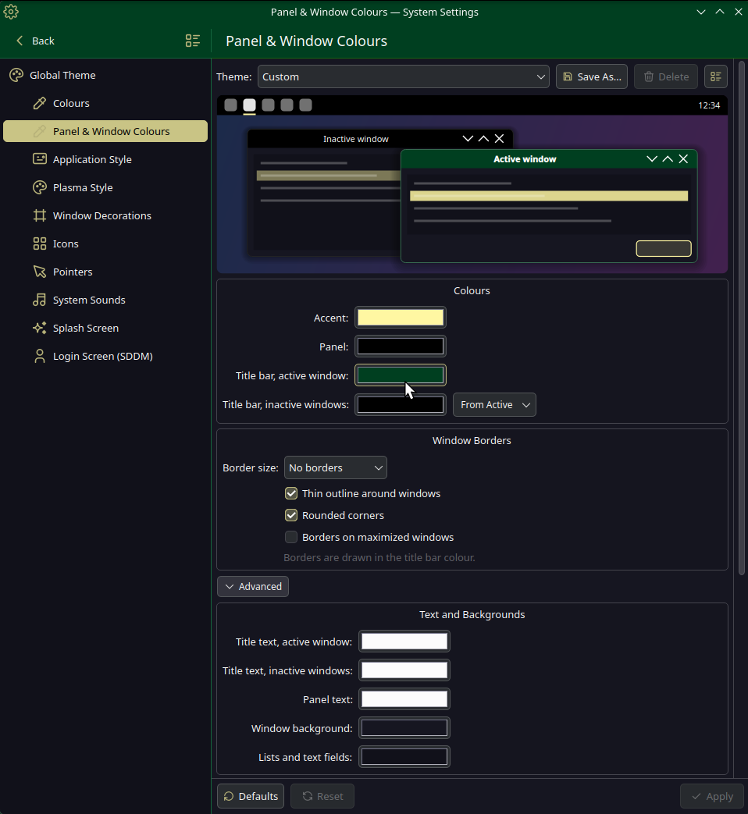

# Panel & Window Colours

A native System Settings module (KCM) for KDE Plasma 6. Set the panel, window and accent colours in
one place and see the changes in a live preview before you apply them.

In System Settings it is listed as **Panel & Window Colours** (Colours & Themes → Panel & Window
Colours). You can also open it from a terminal with `kcmshell6 kcm_svec_colors`.

## Features

**Basic settings**

- Accent colour.
- Panel colour.
- Title bar colour of the active window, and of inactive windows. The inactive colour can be derived
  from the active one with one click (darker, lighter, faded or the same).
- Window borders: border size, a thin outline around windows, rounded corners and borders on
  maximized windows. The border uses the title bar colour.

**Advanced** (expandable section)

- Title text colour for active and inactive windows, and panel text colour.
- Window, list and text field backgrounds.
- Title alignment, button size, a gradient on the title bar and a circle around the close button.
- Shadow: size, strength and colour.
- Take the values from the current system, for example after changing them on another settings page.

**Themes (saved combinations)**

- Save the whole setup under your own name (**Save As…**) and select it later.
- Built-in themes: *Breeze Dark*, *Sand*, *Midnight* and *Graphite*.
- Export a theme to a `.colortheme` file and import it on another computer. Older `.svectheme`
  files can be imported too.
- Changing a built-in theme saves your copy. **Restore** brings back the original version.

## Installation

Dependencies (Fedora):

    sudo dnf install cmake extra-cmake-modules gcc-c++ qt6-qtbase-devel \
        kf6-kcmutils-devel kf6-kconfig-devel kf6-kconfigwidgets-devel \
        kf6-kwidgetsaddons-devel kf6-ki18n-devel kf6-kcoreaddons-devel

Build and install (run in a normal terminal; `sudo` asks for your password):

    ./install.sh

Uninstall:

    ./install.sh --uninstall

If System Settings was open during the installation, close it completely and start it again.

## How it works

When you click **Apply**, the module:

1. writes the accent colour to `~/.config/kdeglobals`,
2. generates a colour scheme `SvecStudio-<hash>` from Breeze Dark and applies it
   (`plasma-apply-colorscheme`),
3. writes the title bar colours directly to `kdeglobals` as well. `plasma-apply-colorscheme` does not
   copy the `[Colors:Header][Inactive]` group, which the Breeze decoration uses for the inactive title
   bar colour,
4. generates a Plasma style `svec-studio-panel-<hash>` from Breeze Dark with the panel colour and
   applies it (`plasma-apply-desktoptheme`),
5. writes the border and shadow settings to `~/.config/breezerc` and `~/.config/kwinrc`,
6. removes previously generated schemes and styles that are no longer used, and reloads KWin.

In the colour scheme list the generated scheme is called *Custom (Panel & Window Colours)*, and in
the Plasma Style list the generated style is called *Custom Panel*. The hash in the file name changes
with the colours, because Plasma does not re-apply a scheme or style with the same name.

| File | Contents |
|---|---|
| `~/.config/svec-studio-colorsrc` | current module settings |
| `~/.local/share/svec-studio-colors/presets/*.colortheme` | your saved themes |
| `/usr/share/svec-studio-colors/presets/*.colortheme` | built-in themes |

A `.colortheme` file is a plain INI file with `[Colors]` and `[Decoration]` groups. Keys that are
missing use the Breeze Dark defaults.

## Limitations

- Borders, outline and shadow only work with the **Breeze** window decoration. With any other
  decoration the module shows a warning and applies only the colours.
- The colour scheme and the Plasma style are based on Breeze Dark. A light base is not available yet.
