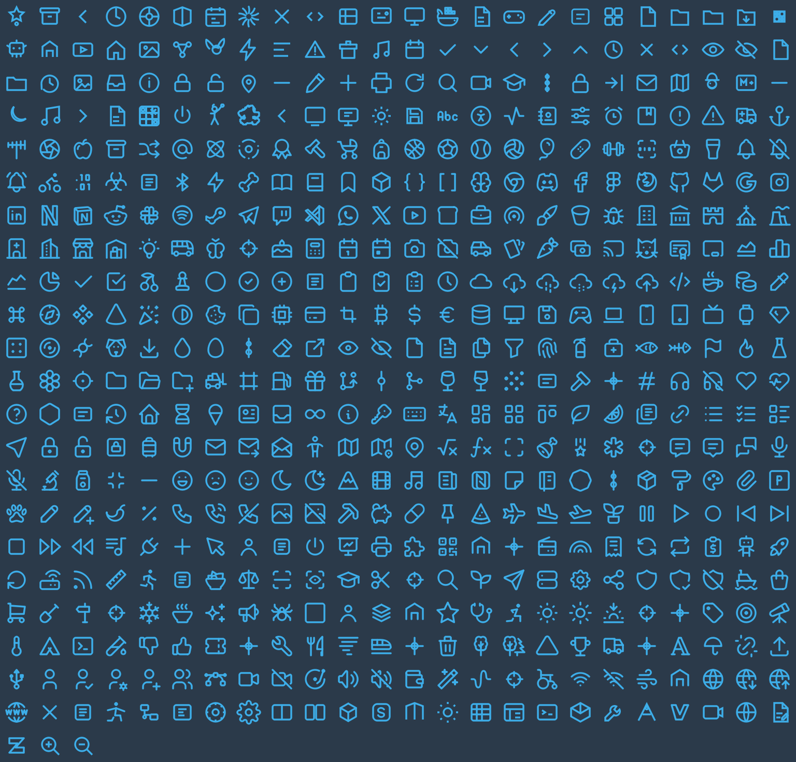
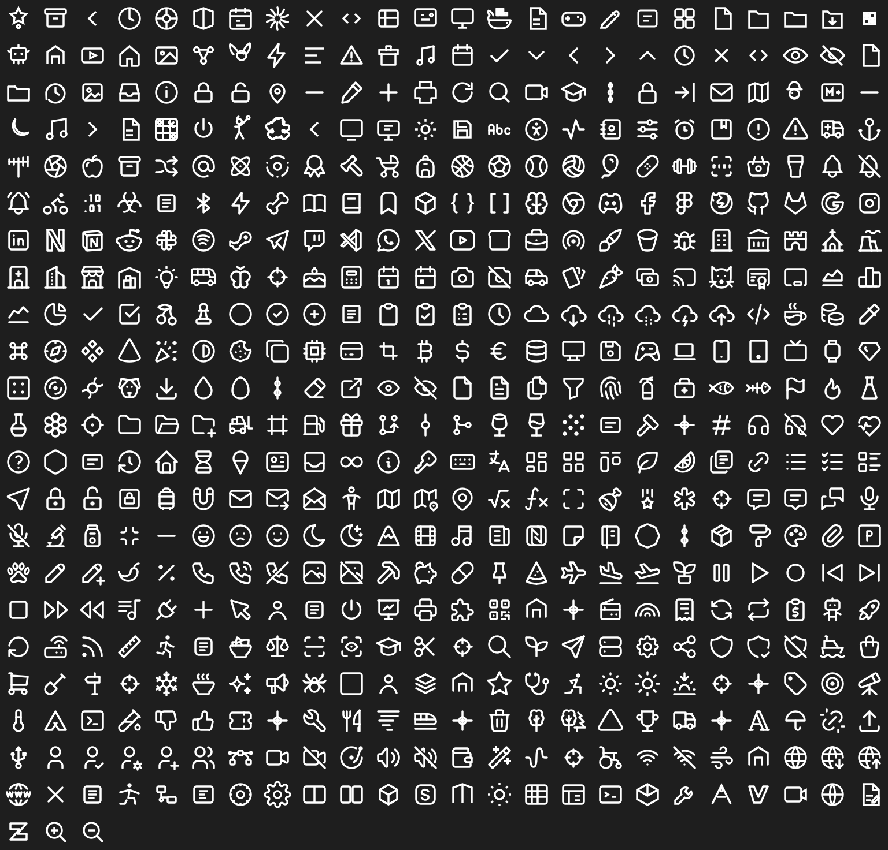
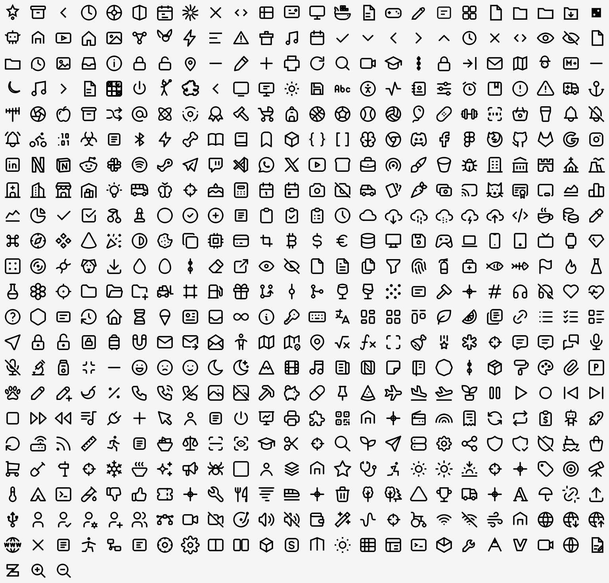

# Svec Studio Icons

An icon pack for Fedora / KDE Plasma in the [Svec Studio](https://github.com/pauliquib/svec-studio) style:
outline SVG icons (`viewBox="0 0 24 24"`, `stroke="currentColor"`, `stroke-width="1.75"`).

The pack covers **every icon name that Breeze contains** (7,100+). Each name is either mapped
directly to a Svec Studio glyph, or generated by `build.py`, which reads the installed Breeze icons and
picks a glyph by keyword or a neutral glyph per context for each missing name. Once activated, it
recolours the whole system, including the system tray, Plasma applets and settings pages, with no
coloured Breeze fallback.

## Variants

| Theme | Version | Behaviour |
|------|-------|---------|
| `SvecStudio-Accent` | v2 | `ColorScheme-Accent`: Plasma recolours it to the system **accent colour** |
| `SvecStudio-White` | v1.1 | fixed white `#ffffff` |
| `SvecStudio-Black` | v1.2 | fixed black `#000000` |

Each variant contains about 8,600 icons across the contexts `apps`, `places`, `actions`, `mimetypes`, `devices`, `status`, `emblems`, `emotes`, `categories`, `preferences`, `applets` and `intl`.

The Accent variant uses the same mechanism as Breeze (`<style id="current-color-scheme">` + `class="ColorScheme-Accent"` + `FollowsColorScheme=true`). Outside KDE it renders with the fallback `#3daee9`.

## Screenshots: all 542 source icons

| Accent | White | Black |
|--------|-------|-------|
|  |  |  |

## Instalace

```bash
# from the pre-built themes (themes/)
cp -r themes/SvecStudio-* ~/.local/share/icons/

# or build and install in one step
python3 build.py --install
```

Activation: **System Settings → Colours & Themes → Icons → “Outline Icons (Accent / White / Black)”**, or from a terminal:

```bash
kwriteconfig6 --file kdeglobals --group Icons --key Theme SvecStudio-Accent
systemctl --user restart plasma-plasmashell.service
```

## Rebuilding after changing icons

```bash
# add or edit an SVG in src/ (the file name is the icon name svec-<name>)
# for a standard freedesktop name, add a line to FDO_MAP in build.py
python3 build.py --install
```

Notes:

- Applications with `Icon=/absolute/path.png` in their `.desktop` file bypass the theme. Change it to an icon name (a user override in `~/.local/share/applications/` works).
- Synthetic icons (battery, UPS, `osd-*` …) are generated directly by `build.py`.
- Breeze completion: while building, `build.py` reads `/usr/share/icons/breeze`. Names that Breeze has and the pack does not are filled in with the nearest Svec glyph (rules `RULES` and `CTX_FALLBACK` in `build.py`). Without Breeze installed this step is skipped.
- `svec-studio` / `cz.svec.Studio` / `start-here*` use a neutral outline “S” mark (`src/svec-studio.svg`). It is recoloured with the variant like the other icons.

## Structure

```
src/       source SVG icons (svec-*.svg; hand-drawn: svec-zed, svec-claude, svec-docker,
           svec-ventoy, svec-stm32cubeide, svec-studio = neutral "S" mark …)
build.py   generator → themes/ (+ --install into ~/.local/share/icons)
themes/    pre-built SvecStudio-{Accent,White,Black} icon themes
```

## Credits

Some glyphs are based on [Tabler Icons](https://tabler.io/icons) (MIT) and on Svec Studio icons.

## License

MIT, see [LICENSE](LICENSE).
