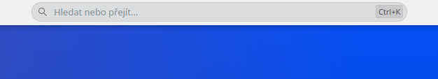

# Search Bar

A KDE Plasma 6 widget that embeds a **search/command input field directly into the panel** — similar to the VS Code command palette or the Windows 10 Cortana search box.

Typing opens a popup with live results powered by **KRunner** (applications, files, calculator, shell commands, web shortcuts, bookmarks, window switching, …), so everything KRunner can do works here too.

## Screenshots

| Dark theme | Light theme |
|---|---|
|  |  |

## Features

- Pill-shaped search field rendered **inside the panel** (not just an icon opening a popup)
- Live KRunner results in a dropdown below the field (all runners enabled in Plasma Search settings apply)
- **Enter** runs the selected/first result, **↑↓** navigates, **Esc** clears and closes
- Global shortcut (**Ctrl+K** by default) moves keyboard focus into the field — configurable in the widget's shortcut settings
- Configurable margin around the field (widget settings → *"Mezera okolo pole (px)"* / spacing)
- Adapts to light and dark Plasma themes

## Requirements

- KDE Plasma **6.x**
- `plasma-workspace`, `plasma5support` and `plasma-milou` (all part of a standard Plasma installation)

## Installation

```bash
git clone https://github.com/pauliquib/plasma-search-bar.git
cd plasma-search-bar
kpackagetool6 -t Plasma/Applet -i package
```

or simply run:

```bash
./install.sh
```

Then add it to a panel:

1. Right-click a panel → **Enter Edit Mode** → **Add Widgets…**
2. Find **Search Bar** and drag it onto the panel
3. To center it, place a **Panel Spacer** on each side of it (spacers expand by default)

Restart the shell if the widget doesn't appear in the list:

```bash
systemctl --user restart plasma-plasmashell.service
```

## Upgrading

```bash
kpackagetool6 -t Plasma/Applet -u package
systemctl --user restart plasma-plasmashell.service
```

## Uninstall

```bash
kpackagetool6 -t Plasma/Applet -r org.psvec.searchbar
```

## Notes

- The default global shortcut **Ctrl+K** is intercepted globally — it may shadow the same shortcut inside applications. Change or remove it via the widget's shortcut settings if that bothers you.
- Useful runners: type `=` for calculator, `gg: query` for web search, or just a command name to launch an app / run a shell command.

## License

GPL-2.0-or-later
