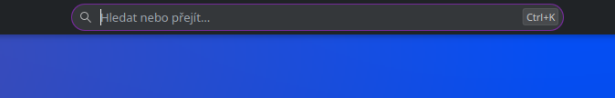
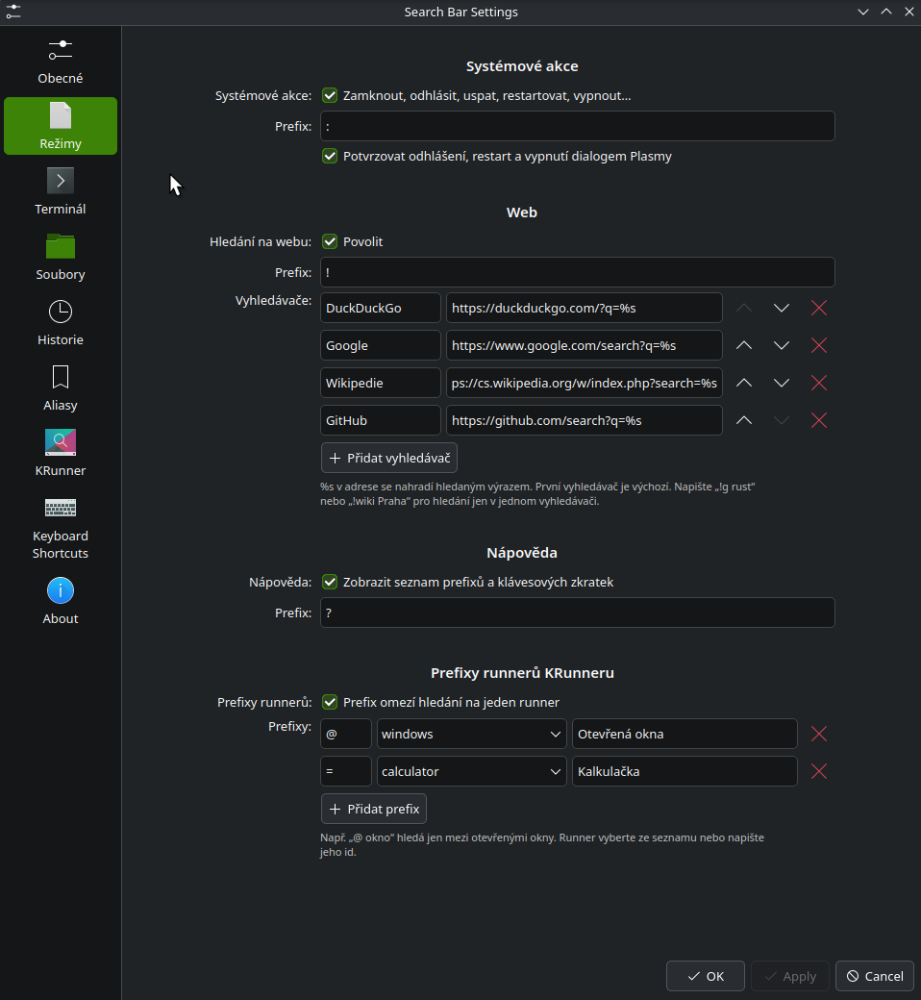

# Search Bar for KDE Plasma 6

Part of [Svec Studio Fedora theme](../README.md).

[](https://kde.org/plasma-desktop/)
[](https://doc.qt.io/qt-6/qtqml-index.html)
[](LICENSE)

A command palette for the Plasma panel, in the spirit of the VS Code quick open / command palette.
The search field lives **directly in the panel** — click it (or press **Ctrl+K**), type, and results
appear in a dropdown right below. It is powered by **KRunner**, so applications, settings, the calculator,
unit conversion, open windows and every other installed runner work out of the box, and it adds
prefix modes for the terminal, files, system actions and the web on top.

| Dark theme | Light theme |
|---|---|
|  |  |

## Features

### Prefix modes

Every mode can be turned off and its prefix changed in the settings.

| Prefix | Mode | Example |
|---|---|---|
| *(none)* | KRunner results – applications, settings, calculator, windows, … | `konsole`, `2+3*4` |
| `>` | Run a command in your terminal, with **suggestions** from `$PATH`, file path completion and command history | `> git status`, `> ls ~/Do` → `~/Downloads/` |
| `/` | Fuzzy file search (fd, find, locate or Baloo) | `/ readme` |
| `:` | System actions – lock, log out, suspend, hibernate, restart, shut down, switch user, empty trash, … | `: lock` |
| `!` | Web search with configurable engines | `! rust`, `! g rust` (Google only) |
| `?` | Help – all active prefixes and keyboard shortcuts | `?` |
| `@`, `=`, … | Restrict results to a single KRunner runner (any installed runner can be mapped) | `@ firefox`, `= 2^10` |

### More

- **Terminal integration** – Konsole, kitty, Alacritty, WezTerm, foot, Ghostty, GNOME Terminal, Ptyxis,
  Xfce Terminal, XTerm or any custom command; configurable working directory; keep the terminal open
  after the command finishes; **run in the background** with the output shown as a desktop notification;
  **run as root**.
- **Recent items** – clicking into the empty field shows what you ran recently (apps, commands, files, searches).
- **Result actions** – open the containing folder, copy the path, open a terminal here, run in the background,
  run as root – via buttons or **Shift+Enter** / **Alt+Enter**.
- **Aliases** – your own shortcuts such as `gs` → `git status` or `yt cats` → a YouTube search
  (`%s` is replaced by the arguments); run in a terminal, in the background, silently, or open a URL/file.
- **Runner filter** – use only selected KRunner runners, grouped in your preferred order.
- Grouped results with headers, highlighted matches and a footer with context-sensitive key hints.
- Follows the Plasma theme (light/dark, accent colour).

### Keyboard

| Key | Action |
|---|---|
| **Ctrl+K** | focus the search field (global shortcut, configurable) |
| **Enter** | run the selected result |
| **Shift+Enter** / **Alt+Enter** | first / second action of the selected result |
| **Ctrl+Enter** | run the typed text in the terminal |
| **Tab** | accept the selected suggestion (command, path, alias, history entry, prefix) |
| **↑ / ↓** | move the selection |
| **Esc** | clear and close |

## Configuration

Right-click the widget → **Configure Search Bar…**. Every feature has its own page
(*General, Modes, Terminal, Files, History, Aliases, KRunner*) and can be enabled or disabled individually.



> The user interface is currently in Czech; all strings go through `i18n()` and can be translated.

## Requirements

- KDE Plasma **6.x** (developed and tested on Plasma 6.7, Wayland)
- `plasma-workspace`, `plasma5support` and `milou` – part of every standard Plasma installation
- Optional: `fd` (faster file search), `plocate`, `notify-send` (output of background commands),
  `wl-copy` / `xclip` (clipboard)

## Installation

```bash
git clone https://github.com/pauliquib/svec-studio-fedora-theme.git
cd svec-studio-fedora-theme/search-bar
./install.sh        # or: kpackagetool6 -t Plasma/Applet -i package
```

Then add it to a panel:

1. Right-click the panel → **Enter Edit Mode** → **Add Widgets…**
2. Search for **Search Bar** and drag it onto the panel
3. To center it, put a **Panel Spacer** on each side

If the widget does not show up in the list, restart the shell:

```bash
systemctl --user restart plasma-plasmashell.service
```

### Upgrade / uninstall

```bash
git pull && kpackagetool6 -t Plasma/Applet -u package && systemctl --user restart plasma-plasmashell.service
kpackagetool6 -t Plasma/Applet -r org.psvec.searchbar
```

## How it works

The widget is a plain QML plasmoid. The field is shown directly in the panel; to let you type into a panel
(which normally never takes keyboard focus) the widget temporarily raises its status to
`AcceptingInputStatus`. Results are rendered in a separate non-focusable window, so the keyboard always stays
in the field. Each prefix mode is a small, independent *provider*; see [docs/ARCHITECTURE.md](docs/ARCHITECTURE.md)
if you want to add your own.

For debugging, load the widget in a standalone window:

```bash
plasmawindowed org.psvec.searchbar
```

## Notes

- **Ctrl+K** is a global shortcut and takes precedence over the same shortcut inside applications.
  Change or remove it in the widget settings (*Keyboard Shortcuts*).
- Some system actions (e.g. *Empty trash*) run immediately; log out, restart and shut down use Plasma's
  confirmation dialog unless you disable it.

## License

[GPL-2.0-or-later](LICENSE)
