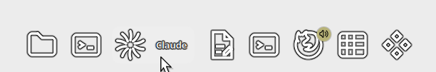

# Expanding Icons Task Manager for KDE Plasma 6

Part of [Svec Studio Fedora theme](../README.md). In Plasma the widget is listed as **Expanding Icons Task Manager**.

[](https://kde.org/plasma-desktop/)
[](https://doc.qt.io/qt-6/qtqml-index.html)
[](LICENSE)

An icon-only task manager for the Plasma panel. There is no background and there are no labels,
only icons. When you hover an icon, it smoothly grows into a pill that shows the window title.
Neighbouring icons slide aside so they are never covered.

The motion is a port of the app rail in the header of [svec-elektro.cz](https://svec-elektro.cz),
moved from HTML/CSS/JS to QML.

| Hover label on the wallpaper | Contrast outline on a light page | Accent colour labels |
|---|---|---|
|  |  |  |

## Features

- Icons only. The applet draws no background of its own and can also hide the background of the
  panel it sits in.
- The hovered icon expands to show the **window title** or the **application name** (configurable).
- The motion is continuous across the whole rail, not a per-icon hover:
  - the closest icon wins and stays sticky while you read its label;
  - icons fade out with distance;
  - neighbours are nudged outward by half of the growth.
- **Readable on any wallpaper.** A contrast outline around icons and text, like desktop icon labels,
  a theme-coloured backdrop behind the expanded label, or both, with adjustable strength.
- Full task manager built on the same `TasksModel` as the stock Plasma one:
  - pinned launchers, window grouping and drag-and-drop reordering;
  - sorting manually, alphabetically, by desktop, by activity or by window position;
  - filters for the current desktop, activity and screen, or minimized windows only.
- **Window previews** on hover (optional): live thumbnails of every window of the task. Click a
  thumbnail to switch to the window, close it from the preview, and hovering a preview can
  highlight that window and hide the others.
- **Audio indicator**: a badge on tasks that play sound. Clicking it mutes or unmutes the task.
  The badge follows the system accent color by default; theme circle, icon only and outline ring
  styles, three sizes and four corners are available.
- Indicator on the panel edge side: a short line for the active window, an orange line for a window
  that demands attention, and a dot for running windows. It can be turned off; its colour follows
  the accent, the text colour, the app icon or a custom colour, and its outline can be turned off
  separately.
- **Left click** activates a window. Clicking the active window minimizes it. Clicking a group
  cycles through its windows, shows them side by side (KWin Window View) or shows a list.
- **Middle click**, **scroll wheel** and the order of new tasks are configurable, the same way as in
  the stock task manager.
- **Right click** opens a menu with new instance, pin/unpin, mute, minimize, maximize, close and
  the applet settings.
- Dragging files over a task raises its window. Dropping files opens them with that application,
  and dropping a `.desktop` file pins it.
- **Meta+1…9** activates the tasks, and an auto-hiding panel shows up when a window wants attention.
- Respects the Plasma animation speed. With animations disabled, the change is instant.
- The motion uses real frame time, so it runs at the same speed on 60 Hz and 144 Hz screens.

## Installation

```sh
git clone https://github.com/pauliquib/svec-studio-fedora-theme.git
cd svec-studio-fedora-theme/taskbar
./install.sh
```

Then add **Expanding Icons Task Manager** to a panel: Edit Mode → Add Widgets. You will probably want to
remove the stock Task Manager from that panel.

To update, run `git pull` in the repository root and then `./install.sh` in this folder. To uninstall, run `kpackagetool6 -t Plasma/Applet -r org.psvec.chiptasks`.

### Fully transparent panel

Enable **Hide the background of this panel** in Appearance. Only the panel that contains the
widget loses its background, blur and shadow. Other panels are not affected, and turning the option
off brings the background back.

It works by setting the panel containment's `backgroundHints` to `NoBackground`. The Plasma shell
(`Panel.qml`) then skips drawing the panel frame, so no extra widget or theme is needed.

## Configuration

### Appearance

| Option | Default |
|---|---|
| Expand the icon with a label on hover | on |
| Label shows: window title / application name | window title |
| Maximum label width | 240 px |
| Highlight background on hover | on |
| Labels in the system accent color | off |
| Label font weight: normal … black | semi-bold |
| Label font size | theme default |
| Readability: off / contrast outline / backdrop behind label / outline and backdrop | contrast outline |
| Outline width / soft edge | 1.4 px / 1.9 px |
| Outline opacity | 82 % |
| Outline color: automatic (opposite of the label) / dark / light / custom | automatic |
| Backdrop opacity | 90 % |
| Show a dot or line for running and active windows | on |
| Indicator color: accent / text color / from the app icon / custom | accent color |
| Contrast outline around indicators | on |
| Show window previews when hovering over tasks | off |
| Hide other windows when hovering over previews | on |
| Show an indicator when a task is playing audio | on |
| Mute task when clicking the indicator | on |
| Audio indicator style: accent color / theme / icon only / outline ring | accent color |
| Audio indicator size: small / normal / large | normal |
| Audio indicator position: top right / top left / bottom right / bottom left | top right |
| Icon size | automatic |
| Spacing between icons: small / normal / large | normal |
| Fill free space on panel, icon alignment start / center / end | off, center |
| Reserve space for expanded labels | on |
| Hide the background of this panel | off |

### Behavior

| Option | Default |
|---|---|
| Group: do not group / by program name | by program name |
| Clicking grouped task: cycles / side by side / textual list | cycles through tasks |
| Sort: manually / alphabetically / by desktop / by activity / by horizontal window position | manually |
| Clicking active task minimizes it | on |
| Middle-clicking: nothing / close / new window / minimize-restore / toggle grouping / to current desktop | opens a new window |
| Scrolling: nothing / cycles through all tasks / cycles through windows of the hovered task | does nothing |
| Skip minimized tasks when scrolling | on |
| Show only tasks from the current desktop / activity / screen, or minimized only | on / on / on / off |
| Unhide an auto-hiding panel when a window wants attention | on |
| New tasks appear to the right / left | right |

### Readability

Without a panel background, icons and labels sit directly on the wallpaper or windows, and a label
whose colour is close to the colour behind it disappears. The widget cannot read the pixels behind
it, so it does not guess. Instead it uses the two techniques that docks and desktop icons use:

- **Contrast outline** (default): icon, label and indicator are drawn in one layer through a small
  fragment shader (`package/contents/shaders/outline.frag`). It dilates their silhouette by 1–2 px
  in 16 directions and adds a feathered edge, in the opposite brightness of the label colour (dark
  for light text, light for dark text). This is how desktop icon labels and subtitles stay readable
  on any background. A blurred drop shadow is not enough, because blurring thins it out on light
  backgrounds. Width, soft edge, opacity and colour are adjustable, with a live preview on light,
  dark and colourful backgrounds in the settings. A wide or very opaque outline fills the inside of
  outline-style icons; a heavier label font weight keeps thin text strokes from drowning in it.
- **Backdrop**: a pill in the theme background colour, lifted by a soft drop shadow like a tooltip,
  fades in behind the expanded label. The label always keeps the contrast of your colour scheme.
  Its opacity follows the expansion, so resting icons stay frameless.

After editing the shader, rebuild it with `qsb --qt6 -o outline.frag.qsb outline.frag`
(package `qt6-qtshadertools`).

## How the expansion works

Each icon sits in a **fixed slot**. The chip is centered on that slot and grows symmetrically, so the icon
never jumps. A single value per chip, `expand` (0–1), drives everything:

```
chip width    = slot + expand × grow        grow = measured label width + gap + end padding
label clip    = expand × labelWidth         label opacity = 0.25 + expand × 0.9
pill tint     = expand × 10 % text colour
neighbour     ± expand × grow / 2           (left ones move left, right ones move right)
```

The **target** of each chip comes from the pointer position:

1. The distance from the pointer to every slot center is measured (fixed centers, not the moving chips).
2. Up to `1.5 × slot` the chip is fully expanded. It then fades out with a smoothstep until
   `2.9 × slot`.
3. The previous winner is **sticky**. It keeps the label until another slot is closer by more than
   `0.75 × slot`. This lets you move across a long label without flicker.
4. The chip directly under the pointer, including its expanded label area, always wins.

On every frame, `expand` moves toward the target. It moves quickly when opening (rate 0.22) and more
slowly when closing (0.12), normalised to real frame time. The animation stops once everything has
settled.

The original web implementation is `bindChipMotion()` in `js/web-apps-render.js` and `.app-chip` in
`css/site.css` of svec-elektro.cz. The ratios are kept the same: slot 2.35 rem, icon 1.85 rem,
gap 0.45 rem, radii 56/110/28 px.

## Limitations

- The labels expand only in horizontal panels. Vertical panels show icons with the hover highlight only.
- No multi-row layout and no minimize-to-icon animation.
- Media controls are not part of the previews; use the Media Player widget for those.

## License

GPL-2.0-or-later, see [LICENSE](LICENSE).
